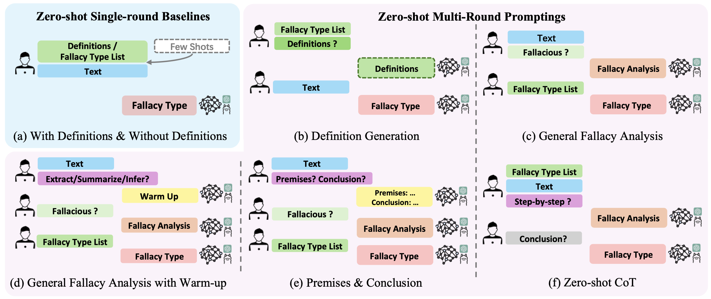

# Are LLMs Good Zero-Shot Fallacy Classifiers? (EMNLP 2024)

[EMNLP 2024](https://aclanthology.org/2024.emnlp-main.794.pdf)

## Usage

### 1. Requirements

    torch==2.5.1
    transformer==4.46.2
    datasets==3.1.0
    numpy==1.26.4

### 2. Download Models

Download the hugging face checkpoints of LLMs ([Llama2](https://huggingface.co/meta-llama/Llama-2-13b-chat-hf/tree/main), [Llama3](https://huggingface.co/meta-llama/Meta-Llama-3-8B-Instruct/tree/main), [Mistral](https://huggingface.co/mistralai/Mistral-7B-Instruct-v0.3/tree/main) and [Qwen2.5](https://huggingface.co/Qwen/Qwen2.5-7B-Instruct/tree/main)) to dir `./models/xxx_hf/`, e.g., `./models/llama3_hf/8bf/`, `./models/llama2_hf/13bf/`, etc.

### 3. Evaluate Models

We provide shell script templates `./run_cmd/run_xxx.sh` for different types of models to reproduce the experiment results in our paper.

Run this command to evaluate T5 (T5-large or T5-3B):
    
    sh ./run_cmd/run_t5.sh

Run this command to evaluate GPT-3.5 or GPT-4:
    
    sh ./run_cmd/run_gpt.sh

Run this command to evaluate small LLMs (Llama3, Llama2, Mistral and Qwen2.5)
    
    sh ./run_cmd/run_llama.sh

## Citation

If you want to use our code, please cite as

    @inproceedings{pan-etal-2024-llms,
        title = "Are {LLM}s Good Zero-Shot Fallacy Classifiers?",
        author = "Pan, Fengjun  and
        Wu, Xiaobao  and
        Li, Zongrui  and
        Luu, Anh Tuan",
        booktitle = "Proceedings of the 2024 Conference on Empirical Methods in Natural Language Processing",
        month = nov,
        year = "2024",
        address = "Miami, Florida, USA",
        publisher = "Association for Computational Linguistics",
        url = "https://aclanthology.org/2024.emnlp-main.794/",
        doi = "10.18653/v1/2024.emnlp-main.794",
        pages = "14338--14364"
    }
